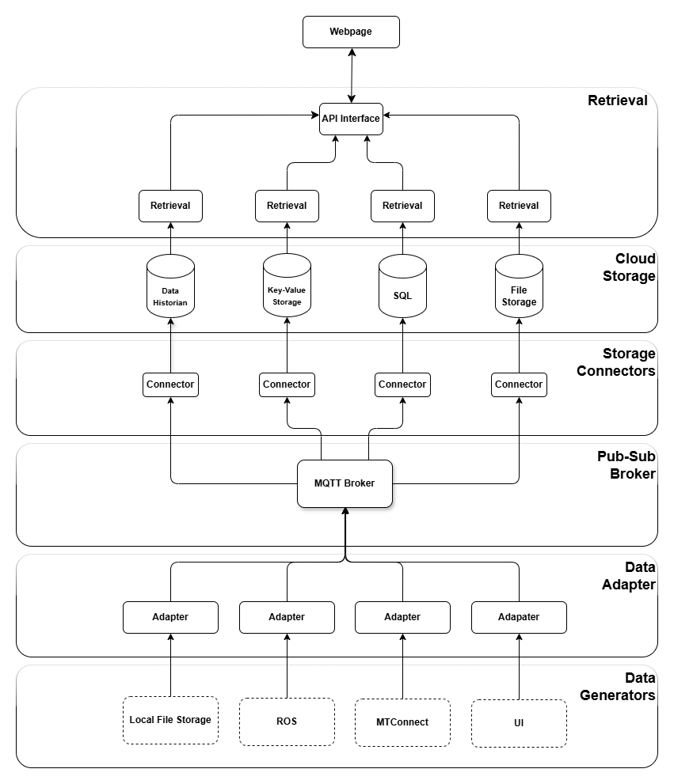

# Architecture

<h1>Descriptions</h1>

**Data Generators**\
The layer shows some example of current and future generators of information for the digital backbone. These sources are responsible for generating data that will be collected and processed by the system.

**Data Adapters**\
Data adapters monitor the data generators for events. They listen for data changes or updates from the data generators and pass the information to the MQTT Broker.

**Publish-Subscribe Broker**\
The MQTT Broker acts as the central communication hub in the pub-sub model. It receives messages from event listeners and distributes them to the appropriate connectors based on specified subscriptions.

**Storage Connectors**\
These connectors subscribe to the MQTT Broker to receive data. They facilitate the transfer of data from the broker to the various storage systems (PI, SQL, File Storage).

**Cloud Storage**\
The cloud storage layer deliniates different storage solutions where data is stored. Currently, we use Aveva PI for our data historian, [add name] for our key-value storage, Widows SQL for our tabular data, and a partitioned drive for our file storage. This solution allows the data storages to be switched out for anything similar, such as Widows SQL for PostgreSQL.

**Retrieval**\
This layer provides retrieval services that can access data stored in the cloud storage.