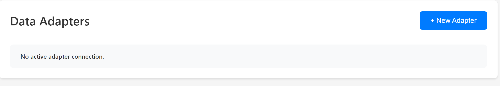
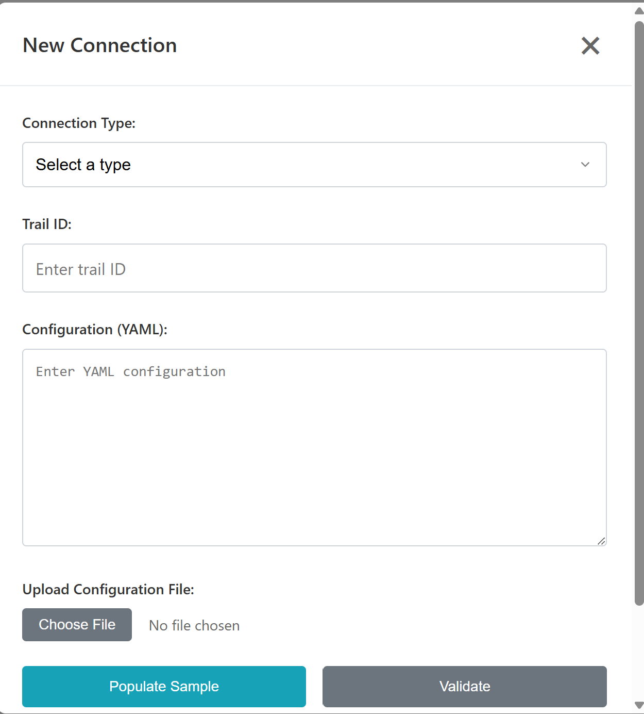

# User Instructions

### Streaming Data

The data adapter library will live in `C:/repos/mfi-ddb`.  
There will be a `README` file with the version that is currently on the computer if there are any issues.

## Creating a New Connection

There are two options for creating a new connection:

### 1. Webpage

It will direct you to the landing page, where you will see a button called **New Adapter**.  

Clicking that will bring up the following pop-up window which lets you configure your connection:

- **Adapter Type**: Choose from a list of supported adapters.
- **Topic Type**: Select the topic of the data stream.
- **YAML Configuration**: Either edit the prefilled YAML in the textbox or upload your own YAML file.

> The text will be validated for correct characters and formatting. The **Submit** button will only be enabled when the configuration is valid.

Once submitted, the system will:
- Run validation tests,
- Start the data connection.

If everything is working and the data is streaming, the indicator will turn **green**.

### 2. CMD Line

*(To be completed - please provide more details if you'd like me to expand this section.)*
