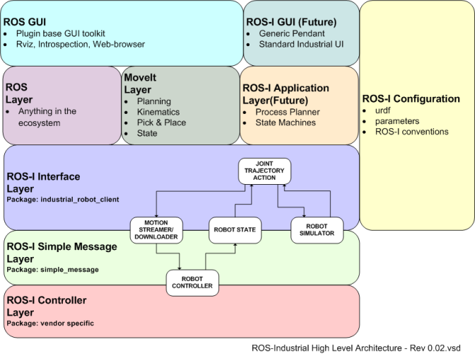

# FANUC ROS1 Interface

The <a href="https://github.com/cmu-mfi/fanuc_ros1" class="inline-button"><i class="fab fa-github"></i>fanuc_ros1</a> repository is a ROS1 interface for FANUC robot arms, specifically designed to work with the R-30iB+ controller. It provides a framework for motion planning and execution using MoveIt, along with various skills for industrial tasks.

```{contents}
```

## Motion Stack and MoveIt 

ROS interface uses the ROS-Industrial stack to plan and execute trajectory. The figure below represents the stack. Details and tutorials to setup the driver and interface can be found [here](http://wiki.ros.org/fanuc/Tutorials).


*Source: [http://wiki.ros.org/Industrial](http://wiki.ros.org/Industrial)*

- **ROS-I Controller Layer** is setup at the robot controller (R-30iB+). [Details ... update link](www.example.com) \

**TODO: Update the Details link**
</br></br>

- **ROS-I Interface Layer** \
[fanuc_lrmate200id_support](https://github.com/cmu-mfi/fanuc_ros1/tree/main/fanuc_lrmate200id_support) \
[Open-source community](http://wiki.ros.org/fanuc) has a support package for many industrial robots, including LR Mate 200iD.
</br></br>

- **MoveIt Layer** \
[fanuc_lrmate200id7l_moveit_config](https://github.com/cmu-mfi/fanuc_ros1/tree/main/fanuc_lrmate200id7l_moveit_config) \
We developed moveit configuration package for LR Mate 200iD robots which is used for trajectory planning.
</br></br>

- **Application Layer** \
[fc_tasks](https://github.com/cmu-mfi/fanuc_ros1/tree/main/fc_tasks) \
We developed a set of services and actions to perform various industrial tasks using the robot arm. These allow to develop custom application using the robot arm without worrying about the underlying motion planning and execution.

<hr>

## Tutorial 1 - Using scripts to test actions and services 

This repository comes with example scripts to test actions and services in 'fc_tasks/scripts'. These are outlined below :


**TODO: Add sim GIF images to the tests below to show expected output.**

### SetPose Service Test
The setPose_test.py script contains an example pose to test the /fc_set_pose service. Modify this as required to test. It's a good idea to execute the same pose multiple times to ensure that all frames are calibrated correctly. 
```shell
python3 ~/ros1_ws/src/fc_tasks/scripts/setPose_test.py
```
### ExecuteCartesianTrajectory Service Test
The cartTraj_test.py script contains a trajectory with 2 waypoints to test the /fc_execute_cartesian_trajectory service. Modify this as required to test. 
```shell
python3 ~/ros1_ws/src/fc_tasks/scripts/cartTraj_test.py
```
### GoToPose Action Test 
The goToPoseAction_test.py script contains an example pose to test the /fc_go_to_pose action server. 
```shell
python3 ~/ros1_ws/src/fc_tasks/scripts/goToPoseAction_test.py
```
### ExecuteCartesianTrajectory Action Test 
The execTrajAction_test.py contains a trajectory with 2 waypoints to test the /fc_execute_cartesian_trajectory_action action server. 
```shell
python3 ~/ros1_ws/src/fc_tasks/scripts/execTrajAction_test.py
```

<hr>

## Tutorial 2 - Configuring the Interface for another Fanuc Robot Arm

<a href="https://github.com/cmu-mfi/fanuc_ros1" class="inline-button"><i class="fab fa-github"></i>fanuc_ros1</a> can be used for any FANUC robot arm with a R-30iB+ controller. This tutorial explains how to configure the interface for a different FANUC robot arm, such as the LR Mate 200iD/7L.

```{note}
This tutorial assumes that the new package is built in a container with the same image as fanuc_ros1. If using a different environment, all dependencies must be satisfied manually as Noetic is now EOL. 
```

### Making changes

1. Find the required support package and moveit config for the robot arm at [fanuc](https://github.com/ros-industrial/fanuc). 
2. Change the package.xml dependencies of <i>fc_tasks</i> and <i>fc_launch</i> to match the new moveit config package (fanuc_lrmate200id7l_moveit_config).
3. Use the urdf file from the downloaded support package to find DH parameters of the new robot arm. Update the .json file in '/fc_tasks/config' with the new values. 
4. In 'fc_launch/launch/moveit.launch', change the 'fanuc_lrmate200id7l_moveit_config' to the new moveit config package and update the 'robot_ip'.
5. Inside the moveit_config package, add the namespaced controllers to the 'config/controllers.yaml' file. Refer 'fanuc_lrmate200id7l_moveit_config'. 
6. Go through the moveit_config launch and config files to see if any file are missing/have different structures due to software updates. 

**TODO: Add a PR to the fanuc_ros1 repository by doing the above changes for a new robot arm.**

```{note}
Most common differences are found in 'move_group.launch', 'moveit_planning_execution.launch' and 'trajectory_execution.launch.xml'. Check all namespaces match this repository
```

### Testing changes

1. Use the fanuc tutorials to ensure that connection with the robot is established and the required drivers are running. 
2. Ensure the moveit_config works standalone, before testing fc_launch. Use the following commands: 

```shell
roslaunch fanuc_lrmate200id7l_moveit_config moveit_planning_execution.launch sim:=true 
roslaunch fanuc_lrmate200id7l_moveit_config moveit_planning_execution.launch sim:=false robot_ip:=<robot_ip>
```
3. Check fc_tasks runs in simulation by keeping sim:=true with no namespace. 

```shell
roslaunch fc_launch moveit.launch sim:=true namespace:=''
```
4. Test with a namespace.

```shell
roslaunch fc_launch moveit.launch sim:=true namespace:='sim1'
```

**TODO: Add an image or GIF**


5. Test on a real robot. 

```{warning}
* Ensure the robot is in a safe state and the environment is clear of obstacles before executing commands on a real robot.
* Keep e-stop button ready to stop the robot in case of any unexpected behavior.
```

```shell
roslaunch fc_launch moveit.launch sim:=false namespace:='real'
```
6. Check 'plan and execute' works in RViz by setting a 'random valid' goal. 
7. Check all ROS services and actions work. An example is shown below:

```shell
rosservice call /sim1/fc_get_pose sim1/base_link 
```

```{note}
This tutorial can be adapted to non-Fanuc robot arms. However, problems may occur due to version difference of support and moveit configs. It is recommended to use this interface repository as a reference and build the new package from the beginning. 
```