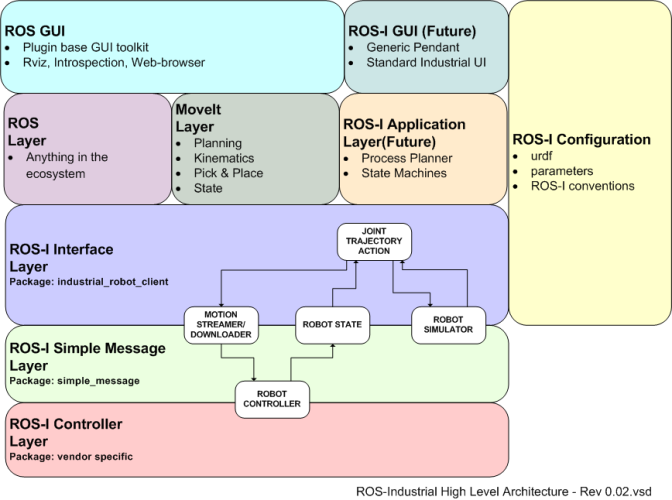

# FANUC ROS1 Interface

<a href="https://github.com/cmu-mfi/fanuc_ros1" class="inline-button"><i class="fab fa-github"></i>fanuc_ros1</a>

The fanuc_ros1 repository is a ROS1 interface for FANUC robot arms, specifically designed to work with the R-30iB+ controller. It provides a framework for motion planning and execution using MoveIt, along with various skills for industrial tasks.

## Software Architecture

The fanuc_ros1 package is an interface layer that enables planning and execution via MoveIt, allows for peripheral control and launches the RViz GUI. In the standard ROS-I architecture, it would fit as shown below. Details and tutorials to setup the driver and interface can be found [here](http://wiki.ros.org/fanuc/Tutorials).


_Source: [http://wiki.ros.org/Industrial](http://wiki.ros.org/Industrial)_

- **ROS-I Controller Layer** is setup at the robot controller (R-30iB+). [Details](https://wiki.ros.org/fanuc/Tutorials/hydro/Installation)
  <br></br>

- **ROS-I Interface Layer** \
  [fanuc_lrmate200id_support](https://github.com/cmu-mfi/fanuc_ros1/tree/main/fanuc_lrmate200id_support) \
  [Open-source community](http://wiki.ros.org/fanuc) has a support package for many industrial robots, including LR Mate 200iD.
  </br></br>

- **MoveIt Layer** \
  [fanuc_lrmate200id7l_moveit_config](https://github.com/cmu-mfi/fanuc_ros1/tree/main/fanuc_lrmate200id7l_moveit_config) \
  We developed moveit configuration package for LR Mate 200iD robots which is used for trajectory planning.
  </br></br>

- **Application Layer** \
  [fc_tasks](https://github.com/cmu-mfi/fanuc_ros1/tree/main/fc_tasks) \
  We developed a set of services and actions to perform various industrial tasks using the robot arm. These allow to develop custom application using the robot arm without worrying about the underlying motion planning and execution.

<hr>

## ROS Packages

- fc_launch
- fc_msgs
- fanuc_lrmate200id_support
- fanuc_lrmate200id7l_moveit_config
- fanuc
- **fc_tasks**

```{note}
`fc_tasks` is the core package which either uses other listed packages or packages, like fc_launch, use fc_tasks to launch the interface.
```

### ROS Services

| Service Name                             | Type                             | Description                                       |
| ---------------------------------------- | -------------------------------- | ------------------------------------------------- |
| `/fc_get_pose`                           | `GetPose.srv`                    | Retrieve the current pose of the robot            |
| `/fc_set_pose`                           | `SetPose.srv`                    | Set a desired pose for the robot                  |
| `/fc_set_joints`                         | `SetJoints.srv`                  | Set robot joint values (uses BiTRRT for planning) |
| `/fc_execute_trajectory`                 | `ExecuteKnownTrajectory.srv`     | Execute a predefined trajectory                   |
| `/fc_stop_trajectory`                    | `StopTrajectory.srv`             | Stop the current trajectory execution             |
| `/fc_execute_cartesian_trajectory`       | `ExecuteCartesianTrajectory.srv` | Execute a cartesian space trajectory              |
| `/fc_execute_cartesian_trajectory_async` | `ExecuteCartesianTrajectory.srv` | Execute a cartesian trajectory asynchronously     |
| `/set_io_value`                          | `SetIO.srv`                      | Set or write a value to an I/O port               |
| `/read_io_value`                         | `ReadIO.srv`                     | Read or get the value from an I/O port            |

### ROS Actions

| Action Name                               | Type                                | Description                                      |
| ----------------------------------------- | ----------------------------------- | ------------------------------------------------ |
| `/fc_go_to_pose`                          | `GoToPose.action`                   | Move the robot to a specified pose               |
| `/fc_go_to_pose_async`                    | `GoToPose.action`                   | Move the robot to a pose asynchronously          |
| `/fc_go_to_joints`                        | `GoToJoints.action`                 | Move robot joints to target values (uses BiTRRT) |
| `/fc_execute_cartesian_trajectory_action` | `ExecuteCartesianTrajectory.action` | Execute a cartesian trajectory as an action      |

### ROS Topic Subscribers

| Topic                        | Topic Name/Type | Description                                                      |
| ---------------------------- | --------------- | ---------------------------------------------------------------- |
| `/check_moving`              | Status Topic    | Indicates whether the robot or manipulator is currently moving   |
| `/execute_trajectory/status` | Status Topic    | Publishes the current status of the ongoing trajectory execution |
| `/joint_states`              | Sensor Topic    | Publishes the current joint positions, velocities, and efforts   |

### ROS Topic Publishers

| Topic Name        | Type           | Description                                    |
| ----------------- | -------------- | ---------------------------------------------- |
| `/tool0_pose`     | Pose Publisher | Publishes the current end effector (tool) pose |
| `/io_states_DOUT` | Digital Out    | Publishes all Digital Output I/O states        |
| `/io_states_DIN`  | Digital In     | Publishes all Digital Input I/O states         |
| `/io_states_AOUT` | Analog Out     | Publishes all Analog Output I/O states         |
| `/io_states_AIN`  | Analog In      | Publishes all Analog Input I/O states          |

```{note}
Note: All methods called by these elements are detailed in the Doxygen formatting style.
```

```{note}
This package also enables Fanuc I/O control using [comet_rpc](https://github.com/gavanderhoorn/comet_rpc). Using the io.launch file, a Fanuc_IO ROS node is launched with the following functionality
```

## Tutorials

```{toctree}
:maxdepth: 2
tutorials.md
```
