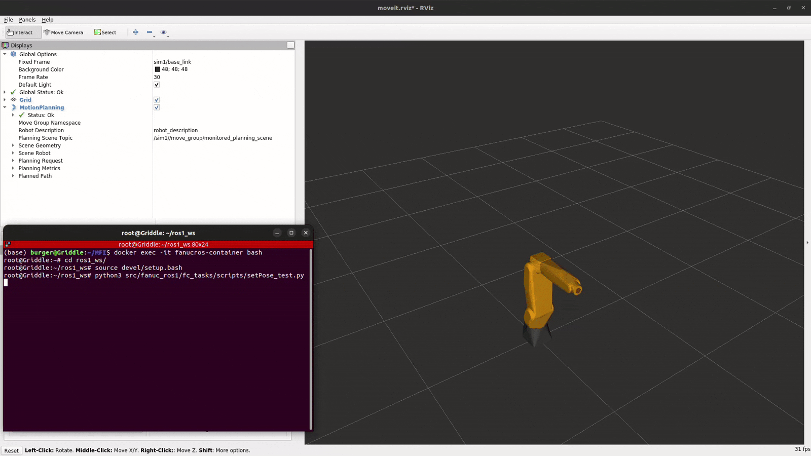

## Tutorial 1 - Testing functionalities and using scripts to test actions and services

### Testing Functionalities

1. Use the fanuc tutorials to ensure that connection with the robot is established and the required drivers are running.
2. Ensure the moveit_config works standalone, before testing fc_launch. Use the following commands:

```shell
roslaunch fanuc_lrmate200id7l_moveit_config moveit_planning_execution.launch sim:=true
roslaunch fanuc_lrmate200id7l_moveit_config moveit_planning_execution.launch sim:=false robot_ip:=<robot_ip>
```

3. Check fc_tasks runs in simulation by keeping sim:=true with no namespace.

```shell
roslaunch fc_launch moveit.launch sim:=true namespace:=''
```

4. Test with a namespace.

```shell
roslaunch fc_launch moveit.launch sim:=true namespace:='sim1'
```

5. Test on a real robot.

```{warning}
* Ensure the robot is in a safe state and the environment is clear of obstacles before executing commands on a real robot.
* Keep e-stop button ready to stop the robot in case of any unexpected behavior.
```

```shell
roslaunch fc_launch moveit.launch sim:=false namespace:='real'
```

6. Check 'plan and execute' works in RViz by setting a 'random valid' goal.
7. Check all ROS services and actions work. An example is shown below:

```shell
rosservice call /sim1/fc_get_pose sim1/base_link
```

```{note}
This tutorial can be adapted to non-Fanuc robot arms. However, problems may occur due to version difference of support and moveit configs. It is recommended to use this interface repository as a reference and build the new package from the beginning.
```

This repository comes with example scripts to test actions and services in 'fc_tasks/scripts'. These are outlined below :

### SetPose Service Test

The setPose_test.py script contains an example pose to test the /fc_set_pose service. Modify this as required to test. It's a good idea to execute the same pose multiple times to ensure that all frames are calibrated correctly.

```shell
python3 ~/ros1_ws/src/fc_tasks/scripts/setPose_test.py
```



### ExecuteCartesianTrajectory Service Test

The cartTraj_test.py script contains a trajectory with 2 waypoints to test the /fc_execute_cartesian_trajectory service. Modify this as required to test.

```shell
python3 ~/ros1_ws/src/fc_tasks/scripts/cartTraj_test.py
```


### GoToPose Action Test

The goToPoseAction_test.py script contains an example pose to test the /fc_go_to_pose action server.

```shell
python3 ~/ros1_ws/src/fc_tasks/scripts/goToPoseAction_test.py
```

Same output as SetPose Service Test.

### ExecuteCartesianTrajectory Action Test

The execTrajAction_test.py contains a trajectory with 2 waypoints to test the /fc_execute_cartesian_trajectory_action action server.

```shell
python3 ~/ros1_ws/src/fc_tasks/scripts/execTrajAction_test.py
```

Same output as ExecuteCartesianTrajectory Service Test.

<hr>

## Tutorial 2 - Configuring the Interface for another Fanuc Robot Arm

<a href="https://github.com/cmu-mfi/fanuc_ros1" class="inline-button"><i class="fab fa-github"></i>fanuc_ros1</a> can be used for any FANUC robot arm with a R-30iB+ controller. This tutorial explains how to configure the interface for a different FANUC robot arm, such as the LR Mate 200iD/7L.

```{note}
This tutorial assumes that the new package is built in a docker container with the same image as fanuc_ros1. If using a different environment, all dependencies must be satisfied manually as Noetic is now EOL. Follow [installations](https://github.com/cmu-mfi/fanuc_ros1?tab=readme-ov-file#installation)
```

### Making changes

1. Find the required support package and moveit config for the robot arm at [fanuc](https://github.com/ros-industrial/fanuc). If a support package is not available, follow the steps at the end of this tutorial to create a new support package.
2. Change the package.xml dependencies of <i>fc_tasks</i> and <i>fc_launch</i> to match the new moveit config package (fanuc_lrmate200id7l_moveit_config).
3. Use the urdf file from the downloaded support package to find DH parameters of the new robot arm. Update the .json file in '/fc_tasks/config' with the new values.
4. In 'fc_launch/launch/moveit.launch', change the 'fanuc_lrmate200id7l_moveit_config' to the new moveit config package and update the 'robot_ip'.
5. Inside the moveit_config package, add the namespaced controllers to the 'config/controllers.yaml' file. Refer 'fanuc_lrmate200id7l_moveit_config'.
6. Go through the moveit_config launch and config files to see if any file are missing/have different structures due to software updates.

<!-- **TODO: Add a PR to the fanuc_ros1 repository by doing the above changes for a new robot arm.** -->

```{note}
Most common differences are found in 'move_group.launch', 'moveit_planning_execution.launch' and 'trajectory_execution.launch.xml'. Check all namespaces match this repository
```

### Testing changes

Use the testing steps described in Tutorial1 to test all interface functionalities.

### Steps to create a support package for ROS-I

- Obtain CAD files - should be part wise and not one whole assembly
- Assemble the CAD in solidworks using coincident and concentric mates for revolute joints. The joint should be able to be moved in the assembly. 
- Get the SolidWorks to URDF plugin and launch it. Follow the instructions and name the links and the joints.
- Generate the full urdf package to get all visual meshes.
- Follow a general robot support package structure - (Use  as reference) and create robot_specific files
- To generate collision meshes, use . Reduce the number of faces to 500 using Filters → Remeshing, Simplification and Reconstruction → Quadric Edge Collapse Decimation. Save as .stl
- Create .xacro files using the urdf. Simple tutorials online and GenAI does an easy enough conversion.
- Have a \_macro.xacro file that calls the .xacro file.
- Test the support package using the launch files created.
- Create a MoveIt config - 
