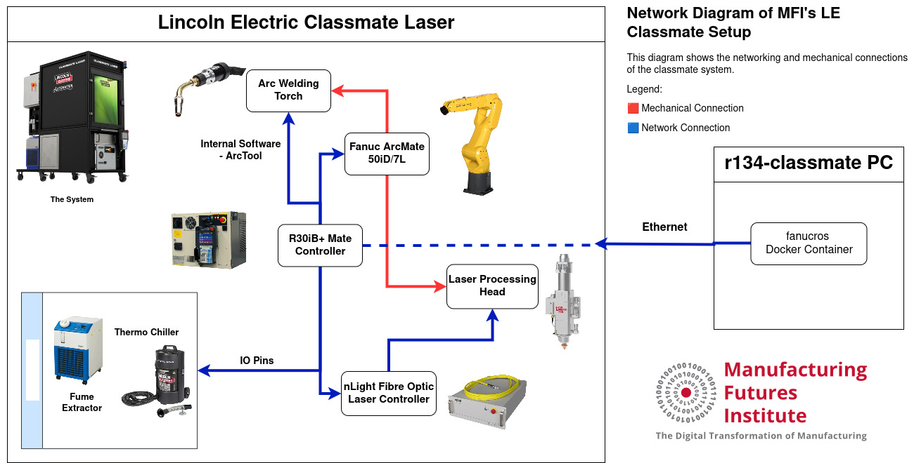
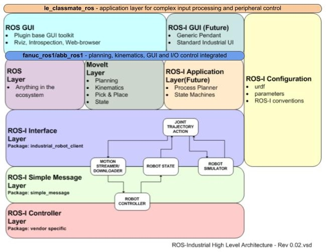

# Lincoln Electric Classmate Laser

The Lincoln Electric Classmate Laser is a compact, all-in-one laser welding cell designed specifically for educational environments to train students in advanced laser welding technologies. It features integrated laser and robotic technology on a mobile cart, along with an arc welding torch.

The network diagram for the setup at MFI is shown below:


The LE Classmate is capable of producing additively manufactured parts. A video showing the classmate using this ROS pacakage to write out the letter 'MFI' is shown below:

](https://www.youtube.com/watch?v=Izd-oDhlwkU)

# le_classmate_ros interface

## ROS Interface for Laser and Arc Welding on Lincoln Electric Classmate Cells

This package provides a ROS-compatible control layer for a Fanuc-driven Lincoln Electric Classmate welding cell. It enables service-based control of welding operations via `comet_rpc`, conversion of CAD geometries into robot trajectories, and execution of coordinated laser or arc weld paths.

## Software Architecture

The le_classmate_ros package is an application software to handle peripheral control and process complex inputs. In the standard ROS-I architecture, it will be the top abstracted layer as shown. 




## Features

- ROS service interface for laser and arc welding control
- DXF-based trajectory generation for weld paths
- Integration with `comet_rpc` for direct I/O-level control of Fanuc systems
- Custom weld macros support via LS files
- Launch file and service definitions for easy orchestration
- Standalone API for non-ROS workflows via the `Welder` class

---

## Services

Provided by `laser_run.py` node:

| Service Name        | Type            | Description                |
| ------------------- | --------------- | -------------------------- |
| `/weld_start`       | `Weld.srv`      | Start arc welding process  |
| `/weld_end`         | `Weld.srv`      | End arc welding process    |
| `/laser_arm`        | `LaserArm.srv`  | Prepare laser for emission |
| `/laser_disarm`     | `LaserArm.srv`  | Disable laser safely       |
| `/laser_emit_start` | `LaserEmit.srv` | Begin laser emission       |
| `/laser_emit_stop`  | `LaserEmit.srv` | Stop laser emission        |

All services return a `bool State` field indicating success.

---

## Welder Class

The welder class has the following methods that can be called using an instance directly, if you prefer to not use ROS Services

| Function Name      | Purpose                  | Description                                                                                                |
| ------------------ | ------------------------ | ---------------------------------------------------------------------------------------------------------- |
| `laser_ready_arm`  | Prepare and arm laser    | Sets laser power, performs safety/alarm checks, locks door, enables controls, waits for ready.             |
| `laser_start_emit` | Start laser emission     | Turns on laser emission (laser output).                                                                    |
| `laser_stop_emit`  | Stop laser emission      | Turns off laser emission, pulses stop controls and resets sync inputs.                                     |
| `laser_disarm`     | Disarm laser safely      | Disables external enable, system on, laser emission, pulses air knife and fume extraction before shutdown. |
| `laser_error`      | Handle laser error       | Prints error message and disarms laser safely (prevents recursive calls).                                  |
| `weld_start`       | Start arc welding        | Checks for gas or wire faults, then starts weld and gas output if all clear.                               |
| `weld_end`         | End arc welding          | Sends command to end weld process.                                                                         |
| `gas_start`        | Start shielding gas flow | Checks for gas faults and enables gas flow output.                                                         |
| `gas_end`          | Stop shielding gas flow  | Stops gas flow output after a delay.                                                                       |

## Tutorial 1 - DXF Trajectory Execution with Laser & Welding Integration

The dxf_script.py package uses is a complete script to perform laser welding using a dxf. The .dxf file must be contained within the workspace bounds (600mm x 800mm). The script also has functionality to scale and center the dxf to parse (x,y) coordinates for robot poses. The script is written using only ROS services to control peripherals. The code is explained below:

This tutorial walks through loading a DXF file, parsing it into robot poses, and executing a Cartesian welding trajectory using ROS1. Laser and weld control are also integrated via services.

---

### 1. Prerequisites

Install required Python packages:

```
pip install ezdxf numpy
```

Ensure the following ROS services are available and active:

- `/real/fc_set_pose`
- `/real/fc_execute_cartesian_trajectory_async`
- `/weld_start`, `/weld_end`
- `/laser_emit_start`, `/laser_emit_stop`
- `/laser_ready_arm`, `/laser_disarm`
- `/set_io_value`

---

### 2. Load and Parse the DXF File

```python
import ezdxf
from geometry_msgs.msg import PoseStamped

DXF_FILE_PATH = "/root/ros1_ws/src/le_classmate_ros/data/MFI8.dxf"
FIXED_Z = 0.405
FIXED_QUAT = (0.707, 0, 0.707, 0)

def parse_dxf_to_poses(dxf_file) -> list:
    doc = ezdxf.readfile(dxf_file)
    msp = doc.modelspace()
    poses = []

    for line in msp.query("LINE"):
        for pt in [line.dxf.start, line.dxf.end]:
            pose = PoseStamped()
            pose.pose.position.x = pt[0]
            pose.pose.position.y = pt[1]
            pose.pose.position.z = FIXED_Z
            pose.pose.orientation.x, pose.pose.orientation.y, pose.pose.orientation.z, pose.pose.orientation.w = FIXED_QUAT
            poses.append(pose)
    return poses
```

This function reads a DXF file and extracts `LINE` entities, converting them into 3D ROS poses with a fixed height and orientation.

---

### 3. Center and Scale the Path

```python
import numpy as np

def transform_to_centre(center_x, center_y, poses, scale):
    delta_x = center_x - 0.53
    delta_y = center_y - 0.01
    transform_matrix = np.array([[1, 0, 0, -delta_x], [0, 1, 0, -delta_y], [0, 0, 1, 0], [0, 0, 0, 1]])

    for pose in poses:
        p = [pose.pose.position.x, pose.pose.position.y, pose.pose.position.z, 1]
        p_new = np.dot(transform_matrix, p)
        pose.pose.position.x = p_new[0] * scale
        pose.pose.position.y = p_new[1] * scale
    return poses
```

This function recenters the poses around a fixed workspace origin and scales them to fit the robot's reach.

---

### 4. Monitor Tool Pose and Trigger IO

```python
import math

def calculate_pose_error(pose1, pose2):
    dx = pose1.pose.position.x - pose2.pose.position.x
    dy = pose1.pose.position.y - pose2.pose.position.y
    dz = pose1.pose.position.z - pose2.pose.position.z
    return math.sqrt(dx**2 + dy**2 + dz**2), 0.0  # Orientation skipped for simplicity

def monitor_pose_callback(msg, targets):
    for i, (idx, target_pose, action) in enumerate(targets):
        if idx in found_targets: continue
        prev_ok = (i == 0) or (targets[i-1][0] in found_targets)
        error, _ = calculate_pose_error(msg, target_pose)
        if error < 0.001 and prev_ok:
            found_targets.add(idx)
            LaserOn(True) if action == "on" else LaserOff(True)
            weldOn(True) if action == "on" else weldOff(True)
```

The `monitor_pose_callback` is a subscriber callback that triggers welding and laser IO actions when the robot's pose reaches specified targets within tolerance.

---

### 5. Initialize ROS Node and Services

```python
import rospy
from fc_msgs.srv import ExecuteCartesianTrajectory, SetPose, SetIO
from le_classmate_ros.srv import LaserEmit, Weld, LaserArm
from geometry_msgs.msg import PoseStamped
import comet_rpc as rpc
import time

rospy.init_node('dxf_trajectory')

# Wait for required services
rospy.wait_for_service('/real/fc_set_pose')
rospy.wait_for_service('/real/fc_execute_cartesian_trajectory_async')
rospy.wait_for_service('/weld_start')
rospy.wait_for_service('/weld_end')
rospy.wait_for_service('/laser_emit_start')
rospy.wait_for_service('/laser_emit_stop')
rospy.wait_for_service('/set_io_value')
rospy.wait_for_service('/laser_ready_arm')
rospy.wait_for_service('/laser_disarm')

# Create service proxies
set_pose = rospy.ServiceProxy('/real/fc_set_pose', SetPose)
execTraj = rospy.ServiceProxy('/real/fc_execute_cartesian_trajectory_async', ExecuteCartesianTrajectory)
weldOn = rospy.ServiceProxy('/weld_start', Weld)
weldOff = rospy.ServiceProxy('/weld_end', Weld)
LaserOn = rospy.ServiceProxy('/laser_emit_start', LaserEmit)
LaserOff = rospy.ServiceProxy('/laser_emit_stop', LaserEmit)
Set_IO = rospy.ServiceProxy('/set_io_value', SetIO)
Laser_Arm = rospy.ServiceProxy('/laser_ready_arm', LaserArm)
Laser_Disarm = rospy.ServiceProxy('/laser_disarm', LaserArm)
```

This block initializes your ROS node and service clients needed to control the welding process.

---

### 6. Setup Monitoring, Execute Trajectory

```python
poses = parse_dxf_to_poses(DXF_FILE_PATH)
found_targets = set()

# Save poses to file for debugging
with open('/root/ros1_ws/src/le_classmate_ros/data/poses.txt', 'w') as f:
    for i, p in enumerate(poses):
        f.write(f"{i} - {p.pose.position.x}, {p.pose.position.y}, {p.pose.position.z}\n")

# Monitor only certain indices
to_monitor_off_indices = [4,7,9]
to_monitor_on_indices = [5,8,10]

combined_targets = [(i, poses[i], "off") for i in to_monitor_off_indices] +                    [(i, poses[i], "on") for i in to_monitor_on_indices]
combined_targets.sort()

rospy.Subscriber('/real/tool0_pose', PoseStamped, monitor_pose_callback, callback_args=(combined_targets,))
```

This section selects key trajectory points to monitor and binds them to the callback for IO control.

---

### 7. Begin Motion Execution

```python
# Move to starting pose
_ = set_pose(poses[0].pose, '/base_link', 0.3, 0.1, 'PTP')

# Setup welding systems
rpc.vmip_writeva('192.168.2.151', "*SYSTEM*", "$MCR.$GENOVERRIDE", value=100)
_ = Set_IO('Digital_OUT', 47, 1)
_ = Laser_Arm(True)
time.sleep(2)
_ = LaserOn(True)
_ = weldOn(True)

# Execute trajectory
_ = execTraj([p.pose for p in poses], 0.01, 0.0, 0.01, 0.01, 0.0)

# Shut down
_ = weldOff(True)
_ = set_pose(poses[-1].pose, '/base_link', 0.3, 0.1, 'PTP')
_ = LaserOff(True)
_ = Laser_Disarm(True)
```

Finally, the robot moves through the full trajectory, with laser/weld triggered as it hits waypoints. After execution, the system is shut down cleanly.

---

### Summary

- Parse DXF into `PoseStamped` waypoints
- Scale/center into workspace
- Monitor robot motion and trigger actions using `Subscriber`
- Execute path with real-time IO via `ServiceProxy`

This pattern can be reused for painting, welding, inspection, and more.

---D

## Tutorial 2 - ROS Welding Routine Explained

This Python script performs a simple two-pass laser welding operation using predefined poses and ROS service calls. Below is a breakdown of the key parts of the code.

---

## 1. **Imports and Constants**

```python
import rospy
import ezdxf
import tf
import math
import numpy as np

from geometry_msgs.msg import Pose, PoseStamped
from fc_msgs.srv import ExecuteCartesianTrajectory, SetPose
from ezdxf.math import BoundingBox2d, Vec2
import comet_rpc as rpc
import time
from le_classmate_ros.Welding import Welder
from le_classmate_ros.srv import LaserArm, LaserEmit, Weld, SetIO
```

These import necessary libraries for ROS control, DXF processing, math, and I/O. The services and message types are specific to a laser welding robot setup.

---

## 2. **Fixed Parameters and Pose Definitions**

```python
FIXED_Z_1 = 0.403
FIXED_Z_2 = 0.405
FIXED_QUAT = (-0.707, 0 , -0.707, 0)
FIXED_Y = 0.02
```

We define fixed heights and orientations for the welding tool. Then we create 4 poses: two for the first weld path, and two for the second (slightly offset in Z).

```python
PointA_1 = PoseStamped()
PointA_1.pose.position.x, PointA_1.pose.position.y, PointA_1.pose.position.z = 0.51, FIXED_Y, FIXED_Z_1
PointA_1.pose.orientation.x, PointA_1.pose.orientation.y, PointA_1.pose.orientation.z, PointA_1.pose.orientation.w = FIXED_QUAT
```

This is repeated similarly for `PointB_1`, `PointA_2`, `PointB_2`.

---

## 3. **Main Execution Block**

```python
if __name__ == '__main__':
    rospy.init_node('dxf_trajectory')
```

We initialize the ROS node and wait for all required services to be available.

### 4. **Service Clients Setup**

```python
set_pose = rospy.ServiceProxy('/real/fc_set_pose', SetPose)
execTraj = rospy.ServiceProxy('/real/fc_execute_cartesian_trajectory_async', ExecuteCartesianTrajectory)
...
```

These are the clients used to command robot motion, welding, and laser behavior.

### 5. **Welder Initialization**

```python
server = '192.168.2.151'
welder = Welder(server=server)
rpc.vmip_writeva(server, "*SYSTEM*", "$MCR.$GENOVERRIDE", value=100)
_ = Set_IO('Digital_OUT', 47, 1) # Enable external control
```

We initialize the Fanuc welder and set necessary flags to enable external control.

---

## 6. **Welding Routine**

### First Pass:

```python
_ = set_pose(PointA_1.pose, '/base_link', 0.01, 0.1, 'PTP')
_ = Laser_Arm(True)
time.sleep(2)
_ = LaserOn(True)
_ = weldOn(True)
_ = set_pose(PointB_1.pose, '/base_link', 0.0075, 0.1, 'PTP')
_ = weldOff(True)
_ = LaserOff(True)
```

We move to start position, arm the laser, begin welding, move to the end point, and stop.

### Second Pass:

```python
_ = set_pose(PointA_2.pose, '/base_link', 0.01, 0.1, 'PTP')
_ = LaserOn(True)
_ = weldOn(True)
_ = set_pose(PointB_2.pose, '/base_link', 0.001, 0.1, 'PTP')
_ = weldOff(True)
_ = set_pose(PointB_2.pose, '/base_link', 0.3, 0.1, 'PTP')  # Move away
_ = LaserOff(True)
_ = Laser_Disarm(True)
```

Same as the first pass, but slightly higher in Z (a "second layer" weld).

---

### 7. Summary

This code executes a controlled laser weld routine along two horizontal lines using ROS services. Each phase—arming, emitting, welding, and disarming—is explicitly timed and ordered.

To extend this:

- Add more poses to trace complex geometries.
- Convert DXF lines to pose sequences.
- Add feedback/error handling for real deployments.

## Tutorial 3 - Using the `Welder` Class Without ROS

The `Welding.Welder` class can be used directly in standalone Python scripts to control welding I/O over RPC:

```python
from fanuc_ros1.le_classmate_ros.src.Welding import Welder
import comet_rpc as rpc
import time


if __name__ == '__main__':

    # Setting up the server
    server = '192.168.2.151'
    welder = Welder(server=server)

    # Setting overwrite to 100
    rpc.vmip_writeva(server, "*SYSTEM*", "$MCR.$GENOVERRIDE", value=100)

    # Enabling external control
    rpc.iovalset(server, rpc.IoType.DigitalOut, index=47, value=1)

    # Arming the Laser
    welder.laser_ready_arm()

    # Starting Laser Emission
    welder.laser_start_emit()

    # Starting welding (robot must be in motion when this state is active)
    welder.weld_start()

    # Move the robot here using your preferred method

    # Stopping welding
    welder.weld_end()

    # Stopping Laser Emission
    welder.laser_stop_emit()

    # Disarming the Laser
    welder.laser_disarm()

```

The class handles all relevant I/O mappings and safety interlocks. An example is shown in scripts/welder_class_example.py

---
