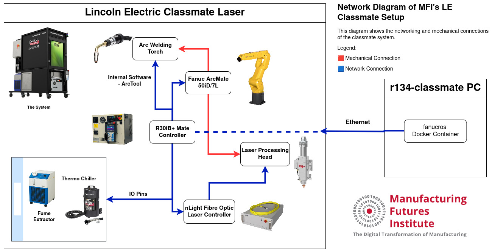
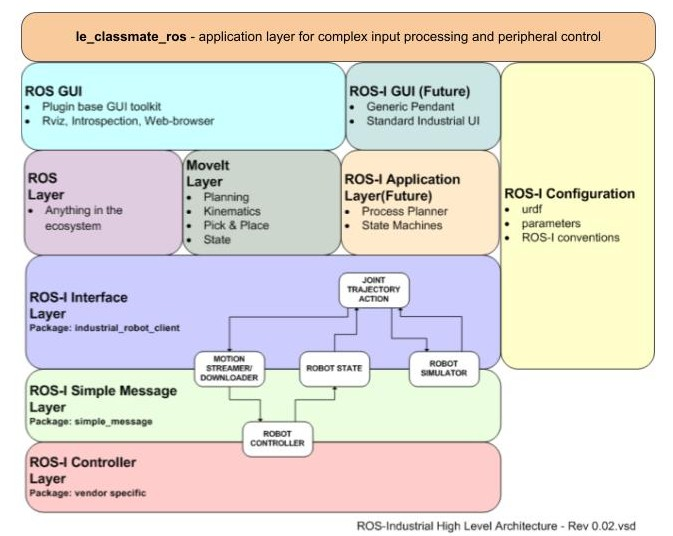

# Lincoln Electric Classmate Laser

<a href="https://github.com/cmu-mfi/le_classmate_ros" class="inline-button"><i class="fab fa-github"></i>le_classmate_ros</a>

The Lincoln Electric Classmate Laser is a compact, all-in-one laser welding cell designed specifically for educational environments to train students in advanced laser welding technologies. It features integrated laser and robotic technology on a mobile cart, along with an arc welding torch.

The network diagram for the setup at MFI is shown below:



The LE Classmate is capable of producing additively manufactured parts. A video showing the classmate using this ROS package to write out the letter 'MFI' is shown below.

<iframe width="704" height="396" src="https://www.youtube.com/embed/Izd-oDhlwkU" title="DXF Demo" frameborder="0" allow="accelerometer; autoplay; clipboard-write; encrypted-media; gyroscope; picture-in-picture; web-share" allowfullscreen></iframe>

<br>

## Software Architecture

The le_classmate_ros package is an application software to handle peripheral control and process complex inputs. In the standard ROS-I architecture, it will be the top abstracted layer as shown.



## le_classmate_ros Package

This package provides a ROS-compatible control layer for a Fanuc-driven Lincoln Electric Classmate welding cell. It enables service-based control of welding operations via `comet_rpc`, conversion of CAD geometries into robot trajectories, and execution of coordinated laser or arc weld paths.

**Features**

- ROS service interface for laser and arc welding control
- DXF-based trajectory generation for weld paths
- Integration with `comet_rpc` for direct I/O-level control of Fanuc systems
- Custom weld macros support via LS files
- Launch file and service definitions for easy orchestration
- Standalone API for non-ROS workflows via the `Welder` class

### ROS Services

Provided by `laser_run.py` node:

| Service Name        | Type            | Description                |
| ------------------- | --------------- | -------------------------- |
| `/weld_start`       | `Weld.srv`      | Start arc welding process  |
| `/weld_end`         | `Weld.srv`      | End arc welding process    |
| `/laser_arm`        | `LaserArm.srv`  | Prepare laser for emission |
| `/laser_disarm`     | `LaserArm.srv`  | Disable laser safely       |
| `/laser_emit_start` | `LaserEmit.srv` | Begin laser emission       |
| `/laser_emit_stop`  | `LaserEmit.srv` | Stop laser emission        |

All services return a `bool State` field indicating success.

---

### Welder Class

The welder class has the following methods that can be called using an instance directly, if you prefer to not use ROS Services

| Method Name        | Purpose                  | Description                                                                                                |
| ------------------ | ------------------------ | ---------------------------------------------------------------------------------------------------------- |
| `laser_ready_arm`  | Prepare and arm laser    | Sets laser power, performs safety/alarm checks, locks door, enables controls, waits for ready.             |
| `laser_start_emit` | Start laser emission     | Turns on laser emission (laser output).                                                                    |
| `laser_stop_emit`  | Stop laser emission      | Turns off laser emission, pulses stop controls and resets sync inputs.                                     |
| `laser_disarm`     | Disarm laser safely      | Disables external enable, system on, laser emission, pulses air knife and fume extraction before shutdown. |
| `laser_error`      | Handle laser error       | Prints error message and disarms laser safely (prevents recursive calls).                                  |
| `weld_start`       | Start arc welding        | Checks for gas or wire faults, then starts weld and gas output if all clear.                               |
| `weld_end`         | End arc welding          | Sends command to end weld process.                                                                         |
| `gas_start`        | Start shielding gas flow | Checks for gas faults and enables gas flow output.                                                         |
| `gas_end`          | Stop shielding gas flow  | Stops gas flow output after a delay.                                                                       |

## Tutorials

```{toctree}
:maxdepth: 2
tutorials.md
```
